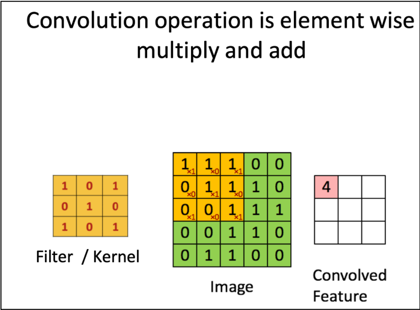
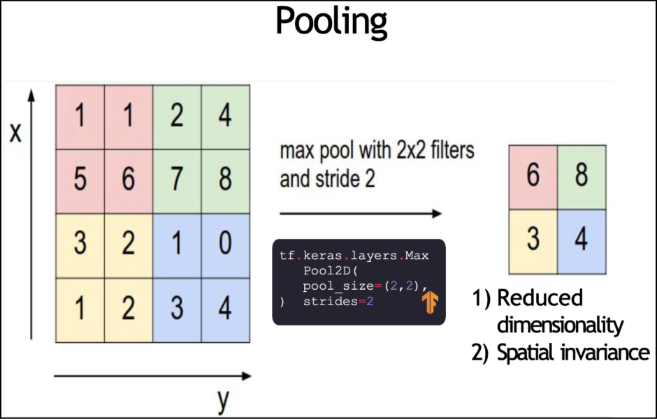
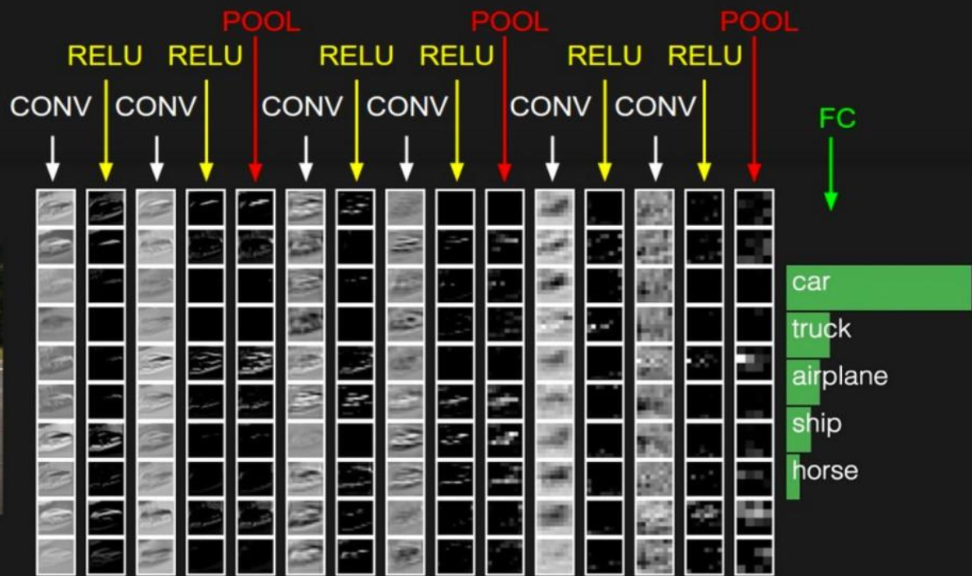
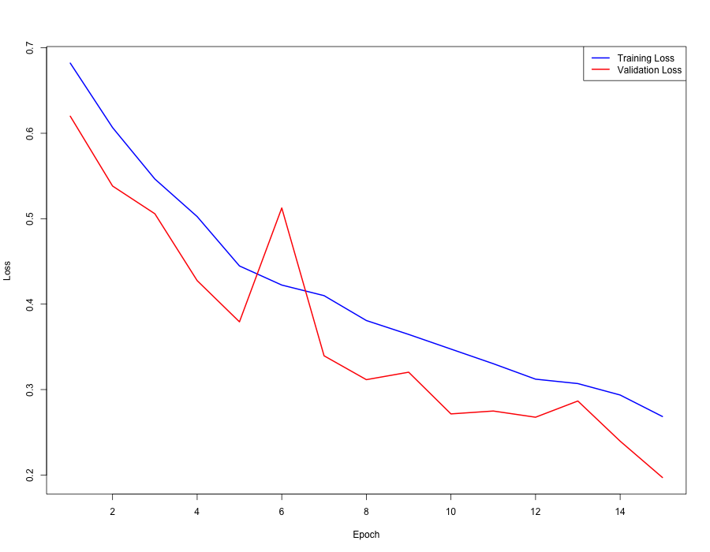
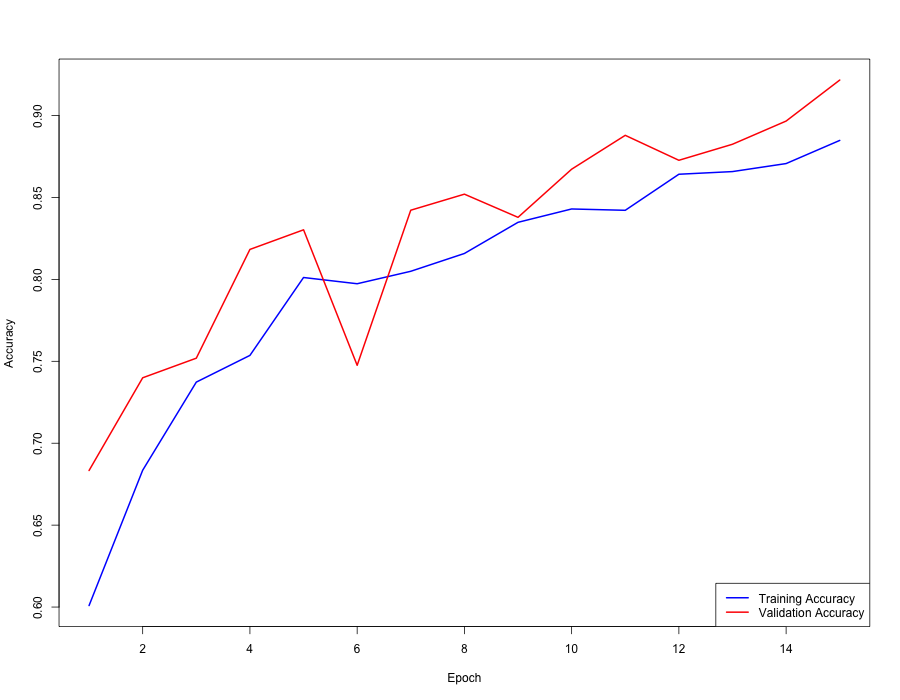
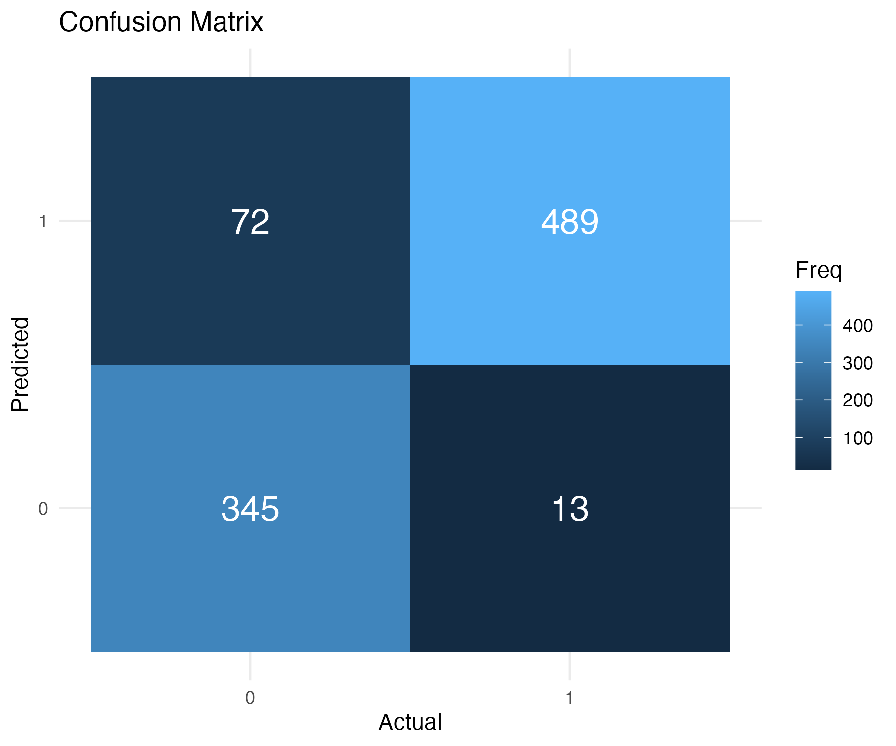
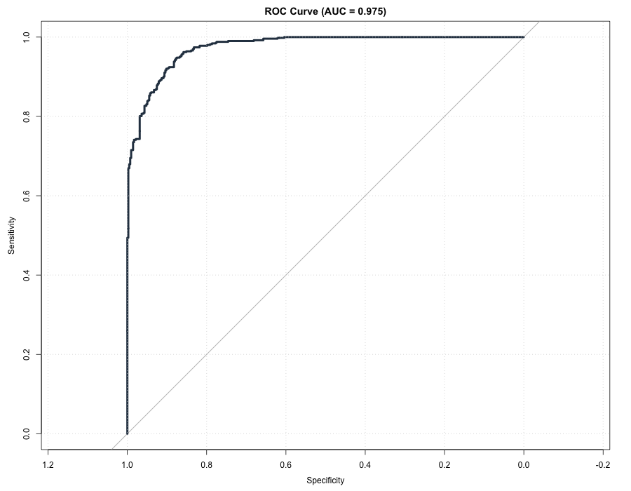

Authors: Lucas Childs, Kaeya Mehta, Sophie Lian, Janice

The topic of our vignette is image classification in the medical setting. We'll demonstrate using a Convolutional Neural Network (CNN) to classify brain tumor X-ray images into 2 classes: `Cancer` and `Not Cancer`. This binary image classification is a classic use-case of how CNNs can be applicable in the medical setting.

## Conceptual Overview

Before CNNs were developed, the standard way to use a Neural Network to train an image classifier was to flatten images into a list of pixels and pass it through a feed-forward neural network in order to predict the class of the image. The spatial information of the images is lost with this technique and it leads to an explosion of parameters since each neuron in one layer is connected to every neuron in the next layer. Thus, this method is not optimal for high dimensional data, especially in the medical setting where genomic data and images are commonly analyzed.

CNNs were designed to process Euclidean spaces, treating images as a grid of pixels. They're able to process images using **convolution**, which uses a filter to scan one segment of the image grid at a time, engaging in **parameter sharing**. The filter is a set of weights (e.g. of size 3x3) that is slid across the image grid, calculating the dot product of the filter and the image at different locations. The output is a feature map, which each filter outputs, each looking for different features. So, instead of learning separate weights for every pixel position, a convolutional layer uses these small sets of learnable filters, essentially sharing these parameters with the entire image space and decreasing the total number of parameters.



Specifically, in our brain tumor detection context, this parameter sharing feature allows the CNN model to efficiently learn fundamental visual patterns from X-ray images without requiring an impossibly large dataset or computational power. It forces the model to focus on what features are present rather than memorizing their exact spatial coordinates.

For example, one convolutional layer in a CNN can have multiple filters, each looking to extract different aspects of the brain x-ray image (e.g. horizontal edges, vertical edges, color contrasts). Once again, the main idea is that parameters are shared: so the filter is slid across the entire image, not just part of it. This enables convolution to generalize features across the whole image field making CNNs robust to variations in the location of objects and to reduce the number of trainable parameters of the Neural Network (reduction to the number of filter weights instead of learning separate weights for each location).

### Hierarchical Feature Learning

CNNs build a hierarchical representation of images throughout its layers. For example,

**Early Convolutional Layers:**

The first layers are primed to learn the most basic building blocks of visual data. Their small filters act as feature detectors for simple patterns: oriented edges (horizontal, vertical, diagonal), color transitions, blobs, and basic textures. In an MRI scan, these correspond to the gradients between white matter, gray matter, and cerebrospinal fluid, or the initial texture of tissue.

**Middle Convolutional Layers:**

As we go deeper, the network combines the simple features from earlier layers into more complex structures. Neurons in these layers might respond to combinations of edges and textures that form shapes like curves, corners, or specific repetitive patterns. For brain tumor analysis, these layers could learn to identify common radiological "parts" such as a mass border/rim, or patterns surrounding a lesion.

**Late Convolutional Layers:**

The final convolutional layers assemble the mid-level parts into complete, more meaningful objects. Here, the feature maps become task-specific, capturing the overall spatial configuration and texture of a specific tumor type or healthy tissue.

### Nonlinearity and Pooling

After each convolutional layer of the network, nonlinearity is applied so the network can learn complex nonlinear patterns. We typically use ReLu as an activation function, which is done before feeding all the feature maps learned in the previous layer to the next convolutional layer.

Pooling layers, placed between convolutional layers, serve two primary purposes.

Pooling is used as downsampling to reduce the size of the data, where feature maps are essentially subsampled. Each subsample is turned into a single pixel value with max pooling or average pooling (taking the maximum pixel value or average pixel value of the subsamples). This progressively decreases the number of parameters in the network, controlling computational cost and mitigating overfitting.



Second, by summarizing a local region, pooling makes the network less sensitive to the exact position of a feature. A small shift or distortion in the location of a detected edge pattern will likely still fall within the same pooling region, and thus the pooled output remains unchanged. This helps the network generalize better so that a tumor's precise pixel location is less important than its relative structure and context.

In our project, pooling is crucial. It ensures that the model focuses on the presence of key diagnostic features (like a tumor's enhancing region) rather than their exact, sub-pixel coordinates, which can vary due to differences in patient positioning or image acquisition.

### Final layers of a CNN

Finally, after convolution, nonlinearity, and pooling, the final layers of a CNN include flattening, the fully connected (or Dense) layer, and regularization. Flattening takes the resulting feature maps and flattens them to a 1-dimensional vector so that they can be used by the final layer to make class predictions. Regularization is a method of regularization used to prevent overfitting. It randomly turns off neurons during training, making sure the model does not become over reliant on specific neurons. The fully connected layer is fed the flattened vector and activated with the sigmoid (our use-case) or softmax functions depending on binary or multiclass classification.



Popular CNN architectures include VGGNet and ResNet (up to 152 layers), with ResNet considered as the state of the art model archietecture. For the purpose of this demonstration, we will introduce a basic CNN with 3 convolutional layers (10 total).

## CNN for tumor classification code demo

### Data Description

The dataset used in this vignette contains 4,600 scanned brain images collected from patients either diagnosed with a brain tumor or confirmed to have no tumor. Each observation includes six columns: an ID, the image filename, the class label (tumor or normal), the file format, the image color mode, and the original image dimensions. The class distribution is relatively balanced, with approximately 55% tumor images and 45% normal images. Most images are stored in JPEG format (98%), with a small number in TIFF or other formats, and the majority use RGB color mode (97%), making the dataset consistent and suitable for CNN-based image classification.

The image sizes vary substantially, ranging from common dimensions such as 512×512×3 and 225×225×3 to over 3,300 other unique shapes. This diversity in resolution requires preprocessing steps such as resizing and normalization before model training. Overall, the dataset provides a large and realistic set of brain scan images that supports effective training, evaluation, and generalization of deep learning models for tumor detection.

Although the dataset is large and varied in format, a key limitation is that it appears to contain many duplicated or near-duplicated images. Several scans look almost identical, with only small changes in brightness, contrast, or quality, suggesting that some form of augmentation or repeated sampling occurred before the dataset was published. When such a dataset is split into training, validation, and test sets, it becomes likely that similar images end up in multiple subsets. This can make the model performance appear stronger than it truly is because it may encounter images during testing that closely resemble images it effectively saw during training.

### Environment / Data Setup

We first start by loading the libraries necessary to run a CNN.

```{r, eval=FALSE}
library(keras)
library(tensorflow)
library(ggplot2)
library(caret)
library(dplyr)
library(reticulate)
library(pROC)
library(readr)
library(fs)
library(rsample)
library(tidyverse)
```

We then upload the data. The dataset that we use contains labeled medical MRI brain scans used for tumor classification (binary variable). Each row represents a single image and includes ifnormation about the file including the name of the image, the class (tumor or normal), the format (png, jpeg, tif), the RGB color mode, and the shape/resolution of the image.

```{r, eval=FALSE}
metadata <- read_csv("data/metadata.csv.xls")
head(metadata)
colnames(metadata)
```

We split the dataset into an 80/20 train–test split.

```{r, eval=FALSE}
set.seed(11272025)
train_index <- createDataPartition(metadata$class, p = 0.8, list = FALSE)
train_data <- metadata[train_index, ]
test_data  <- metadata[-train_index, ]
nrow(train_data)
nrow(test_data)
```

After we have split the dataset, we create directories to store our training and testing brain scan images.

```{r, eval=FALSE}
dir_create("data/images", showWarnings = FALSE)
dir_create("data/train_images")
dir_create("data/test_images")

# Copy each file based on split into training and test sets

file_copy(
  path = paste0("data/images/", train_data$image),
  new_path = paste0("data/train_images/", train_data$image)
)

file_copy(
  path = paste0("data/images/", test_data$image),
  new_path = paste0("data/test_images/", test_data$image)
)
```

### Preprocessing

Because neural networks require all input images to have the same dimensions, we resize all images to a target size of 224x224. We also set the batch size to 32. The batch size controls how many images the model processes at each training step before updating its weights. Processing the images in smaller batches helps improve training stability and efficiency.

```{r, eval=FALSE}
img_height <- 224
img_width  <- 224
batch_size <- 32
```

The image generator loads training images and applies data augmentation like rotating or shifting the image. Augmentation increases the diversity of the training set, helping the model avoid overfitting and improving its ability to generalize new images.

```{r, eval=FALSE}
train_gen <- image_data_generator(
  rescale = 1/255,
  rotation_range = 10,
  width_shift_range = 0.1,
  height_shift_range = 0.1,
  horizontal_flip = TRUE
)
```

We also create a testing generator with no augmentation of images so that the model is tested on clean data.

```{r, eval=FALSE}
test_gen <- image_data_generator(rescale = 1/255)
```

The `flow_images_from_dataframe()` reads in the images in batches from the training and test folders, applies the respective preprocessing (resizing and augmentation if needed), and records the corresponding true labels from the uploaded data.

```{r, eval=FALSE}
train_flow <- flow_images_from_dataframe(
  dataframe = train_data,
  directory = "data/train_images",
  x_col = "image",
  y_col = "class",
  generator = train_gen,
  target_size = c(img_height, img_width),
  batch_size = batch_size,
  class_mode = "binary"
)

# flow images from the test dataframe
test_flow <- flow_images_from_dataframe(
  dataframe = test_data,
  directory = "data/test_images",
  x_col = "image",
  y_col = "class",
  generator = test_gen,
  target_size = c(img_height, img_width),
  batch_size = batch_size,
  class_mode = "binary",
  shuffle = FALSE
)
```

### Build CNN Model

This CNN has three layers for feature extraction starting with simple edges/textures, and then moving to more complex patterns. After this, the model uses flatten layer and then dense layer to combine the features. There is also a dropout layer to reduce overfitting and help the model better generalize. Finally, theres a sigmoid output layer to generate aprobability between 0 and 1, allowing the model to perform binary classification.

```{r, eval=FALSE}
model <- keras_model_sequential(list(
  # 32 convolution filters of size 3x3
  layer_conv_2d(filters = 32, kernel_size = 3, activation = "relu",
                input_shape = c(img_height, img_width, 3)),
  layer_max_pooling_2d(pool_size = 2),
  
  # 64 filters
  layer_conv_2d(filters = 64, kernel_size = 3, activation = "relu"),
  layer_max_pooling_2d(pool_size = 2),
  
  # 128 filters
  layer_conv_2d(filters = 128, kernel_size = 3, activation = "relu"),
  layer_max_pooling_2d(pool_size = 2),
  
  # Flatten and dense layers
  layer_flatten(),
  layer_dense(units = 128, activation = "relu"),
  layer_dropout(rate = 0.4),
  
  # Output layer
  layer_dense(units = 1, activation = "sigmoid")
))

# Compile the model

model$compile(
  optimizer = "adam",
  loss = "binary_crossentropy",
  metrics = list("accuracy")
)
model
```

### Train CNN Model

The model is then trained for 15 epochs using the training generator. During each epoch, the model is also evaluated on the test generator, and both the training loss and accuracy and test loss and accuracy are reported.

```{r, eval=FALSE}
epochs <- 15

history <- model$fit(
  train_flow,
  steps_per_epoch = r_to_py(as.integer(ceiling(nrow(train_data) / batch_size))),
  validation_data = test_flow,
  validation_steps = r_to_py(as.integer(ceiling(nrow(test_data) / batch_size))),
  epochs = r_to_py(as.integer(epochs))
)

# Convert Python history to R list
history_values <- py_to_r(history$history)
```

We then plot the loss and accuracy for each epoch.

```{r, eval=FALSE}
plot(1:epochs, history_values$loss, type = "l", col = "blue", lwd = 2,
     xlab = "Epoch", ylab = "Loss", ylim = range(c(history_values$loss, history_values$val_loss)))
lines(1:epochs, history_values$val_loss, col = "red", lwd = 2)
legend("topright", legend = c("Training Loss", "Validation Loss"),
       col = c("blue", "red"), lwd = 2)
```



```{r, eval=FALSE}
plot(1:epochs, history_values$accuracy, type = "l", col = "blue", lwd = 2,
     xlab = "Epoch", ylab = "Accuracy", ylim = range(c(history_values$accuracy, history_values$val_accuracy)))
lines(1:epochs, history_values$val_accuracy, col = "red", lwd = 2)
legend("bottomright", legend = c("Training Accuracy", "Validation Accuracy"),
       col = c("blue", "red"), lwd = 2)
```



### Evaluating the Model

```{r, eval=FALSE}
scores <- model$evaluate(test_flow)

# Convert Python evaluation output to R list
scores_r <- py_to_r(scores)
test_loss <- scores_r[[1]]
test_accuracy <- scores_r[[2]]

cat("Test loss:", test_loss, "\n")
cat("Test accuracy:", test_accuracy, "\n")
```

This section evaluates the trained CNN on the test dataset to measure how well it generalizes to unseen images. The `model$evaluate()` function computes two key metrics: test loss, which measures overall prediction error, and test accuracy, which measures the proportion of correctly classified images. By converting the Python output into an R list, we extract and print these values. A high accuracy value of 0.9075081 and generally low loss value of 0.2428377 indicate that the model has learned meaningful patterns from the training data and performs reliably on new samples from the test data.

### Confusion Matrix

```{r, eval=FALSE}
# Get predicted probabilities
pred_probs <- model$predict(test_flow)

# Convert probabilities to class labels (0 or 1)
pred_labels <- ifelse(pred_probs >= 0.5, 1, 0)

true_labels <- test_flow$classes 


cm <- caret::confusionMatrix(factor(pred_labels), factor(true_labels), 
                             positive = "1")

# Plot confusion matrix heatmap using ggplot
cm_df <- as.data.frame(cm_table)
colnames(cm_df) <- c("Predicted", "Actual", "Freq")


p_cm <- ggplot(cm_df, aes(x = Actual, y = Predicted, fill = Freq)) +
  geom_tile() +
  geom_text(aes(label = Freq), color = "white", size = 6) +
  labs(title = "Confusion Matrix", x = "Actual", y = "Predicted") +
  theme_minimal()
p_cm


ggsave("img/confusion_matrix.png", plot = p_cm, width = 6, height = 5)
```

Along with computing test accuracy and loss, we can also assess model performance at the prediction level by examining the confusion matrix, which shows how many images were correctly or incorrectly classified. First, predicted probabilities are converted into binary labels (0 or 1 for tumor vs. no tumor), and these are compared to the true labels from the test set. The `caret::confusionMatrix()` function provides precision, recall, sensitivity, specificity, and an overall accuracy score. To make the results easier to visualize, we convert the confusion matrix into a dataframe and generate a heatmap with ggplot2. This visualization highlights where the model succeeds and where it makes mistakes, helping diagnose model weaknesses or class imbalance. As we can see from the visualization, our model correctly identified 489 images with tumors, and 345 images without tumors. Additionally, the model only misclassified a small amount of images, incorrectly classifying 72 images to have a tumor when they didn't, and 13 images to not have a tumor when they in fact did. The confusion matrix indicates that the model correctly classified the majority of images, resulting in a high overall accuracy despite some misclassifications. Moreover, in a medical context, the model’s tendency to flag more false positives than false negatives is preferable, as it errs on the side of caution by reducing the risk of missing actual tumor cases.



### ROC Curve and AUC

```{r, eval=FALSE}
roc_obj <- roc(response = true_labels, predictor = as.numeric(pred_probs))
auc_val <- auc(roc_obj)
cat("AUC:", auc_val, "\n")
# 0.9750686


png("img/roc_curve.png", width = 900, height = 700)
plot(roc_obj)
```

The ROC curve provides a visual summary of the model’s ability to distinguish between tumor and non-tumor images across all possible classification thresholds. By plotting sensitivity (true positive rate) against 1 – specificity (false positive rate), the ROC curve illustrates how the model’s performance changes as the decision threshold shifts, highlighting the trade-off between capturing more true tumors and avoiding false alarms. The curve demonstrates strong separation between the two classes, and the resulting AUC value of 0.975 indicates excellent discriminatory performance, meaning the model can correctly rank tumor images above non-tumor images with very high probability.



### Saving the Model

```{r, eval=FALSE}
dir_create("results")
model$save("results/cnn_brain_tumor_model.keras")

cat("Model saved to results/cnn_brain_tumor_model.h5\n")
```

Finally, we save the trained CNN model so it can be reused without needing to retrain it. We created a results/ folder and save the model in .keras format, which preserves both the architecture and the trained weights. Saving the model ensures that it can be loaded later for inference, further training, or deployment in a clinical or research workflow. This also makes the results reproducible and portable across systems.

## Conclusion

In this vignette, we demonstrated how Convolutional Neural Networks can be applied to medical image classification by training a CNN to distinguish between brain tumor and non–tumor X-ray scans. Through preprocessing, data augmentation, and a three-layer convolutional architecture, the model successfully learned meaningful visual patterns and achieved strong evaluation metrics. The model reached a test accuracy of 0.9075 with a relatively low loss of 0.2428, and additional performance assessments such as the confusion matrix and ROC curve indicated excellent class separation and reliable predictive behavior. These results highlight the effectiveness of CNNs for medical binary image classification.

However, an important limitation of this dataset is the presence of substantial oversampling and duplicated or near-duplicated images. Some images were augmented before the dataset was published, so when we split data in training vs testing sets, we could not make sure augmented images were only placed into the training set, so some of these oversampled data ended up in the test set making the test error appear lower than it actually should be. Ideally, all preprocessing or image augmentation is done on training data so that the model can learn to be more robust, and then evaluated on unaltered test images. This oversampling likely contributed to the strong performance metrics we observed, including the high test accuracy and low loss value. While the results appear impressive, they may not fully reflect the model’s ability to generalize to genuinely new brain scan images. This limitation should be kept in mind when interpreting the model's performance, but the CNN still demonstrates promising capability and is a good example of a basic CNN used for image classification on medical data. Future work should involve cleaning the dataset or evaluating the model on a more carefully curated, non-duplicated test set to better assess its true generalization power.
